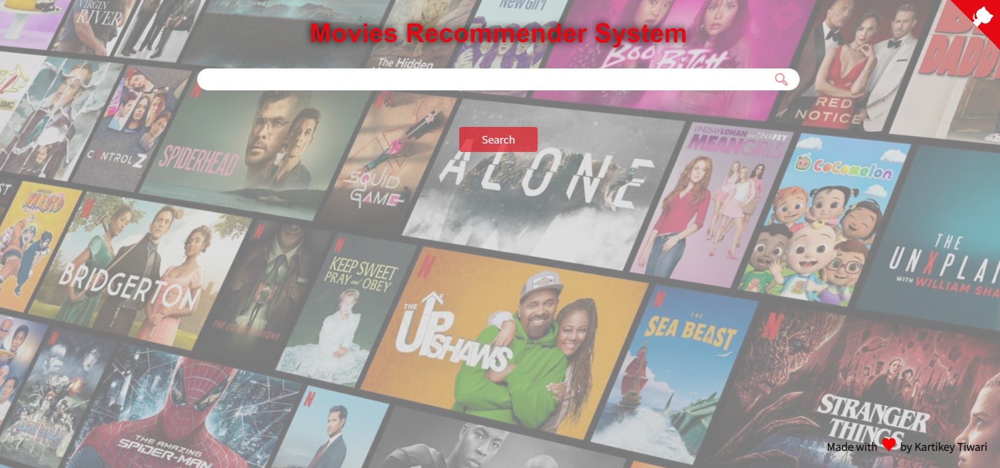

# Movie Recommender System

Content Based Recommender System recommends movies similar to the movie user likes and analyses the sentiments on the reviews given by the user for that movie.

The details of the movies(title, genre, runtime, rating, poster, etc) are fetched using an API by TMDB, https://www.themoviedb.org/documentation/api, and using the IMDB id of the movie in the API. 

We use *web scraping* to get the reviews given by the user in the IMDB site using beautifulsoup4 and performed sentiment analysis on those reviews.

## Deployment

### Steps To Deploy The App:

Prepare your dataset:

        1. Data Extraction
        2. Exploratory Data Analysis(EDA)
        3. Feature Engineering
        4. Model Building and Tuning
        5. Building Flask API
        6. Pushing code to Github
        7. Connecting to your Azure account 
        8. Deploy App

## Screenshots

## Demo

[Click HERE To View App](https://movierecommendersytem.azurewebsites.net)

# Hi, I'm Kartikey Tiwari! 👋

## 🔗 Links

## 🛠 Skills
- Python  

- Statistics 
- NLP
- Machine Learning 
- Flask
- Azure

## Future Plans 
⚡️ Looking forward to help drive innovations into your company as a Data Scientist

⚡️ Looking forward to mentor students and data science enthusiasts

⚡️ Looking forward to offer more than I take and leave the place better than i found
